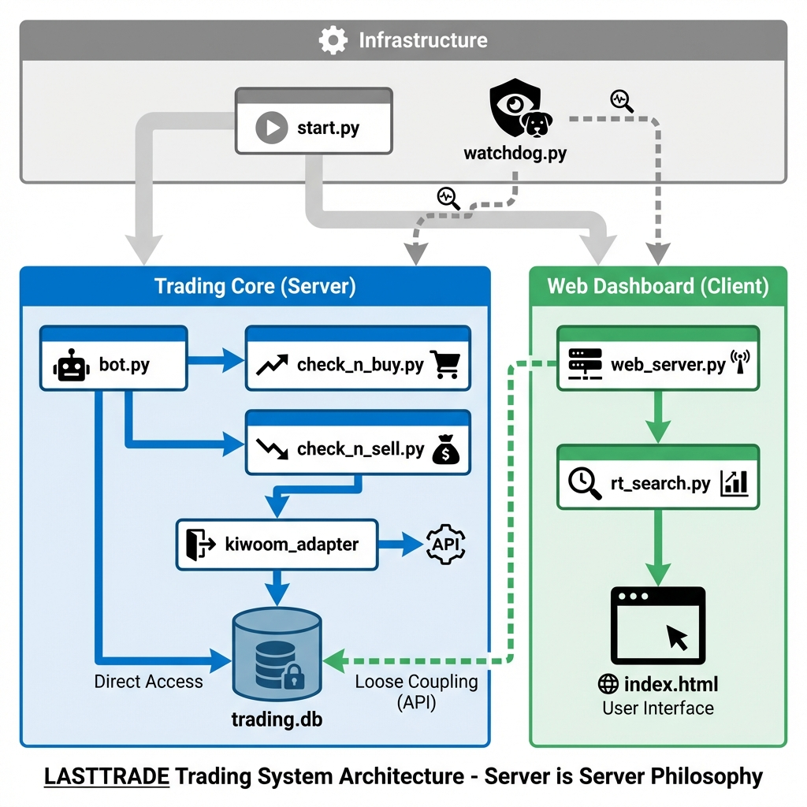

# 📘 LASTTRADE 시스템 매뉴얼 (System Architecture Manual)

> **Core Philosophy**: "Server is Server." 
> 핵심 로직은 UI와 독립적으로 작동하며, 원칙(Principles)을 최우선으로 수행한다.

## 🗺️ 시스템 아키텍처 다이어그램



### 📐 구조도 (Mermaid Code)

```mermaid
graph TD
    %% 스타일 정의
    classDef server fill:#e1f5fe,stroke:#01579b,stroke-width:2px;
    classDef client fill:#e8f5e9,stroke:#2e7d32,stroke-width:2px;
    classDef infra fill:#f5f5f5,stroke:#616161,stroke-width:2px;
    classDef db fill:#fff9c4,stroke:#fbc02d,stroke-width:2px,shape:cylinder;

    subgraph Infrastructure [🛡️ Infrastructure (운영/관리)]
        direction TB
        START(start.py) --> WD(watchdog.py)
        STOP(stop.py)
    end

    subgraph Server [🧠 Trading Core (Server)]
        direction TB
        BOT(bot.py) --> BUY(check_n_buy.py)
        BOT --> SELL(check_n_sell.py)
        BOT --> OPT(optimize_settings.py)
        BUY --> K(kiwoom_adapter.py)
        SELL --> K
    end

    subgraph Client [🖥️ Web Dashboard (Client)]
        direction TB
        WEB(web_server.py) --> RT(rt_search.py) --> UI[Browser / index.html]
    end

    subgraph Voice [🔊 Voice Support]
        VG(voice_generator.py)
    end

    DB[(trading.db)]

    %% 관계 정의
    START --> BOT
    START --> WEB
    WD -.->|Heartbeat 감시| BOT
    WD -.->|Heartbeat 감시| WEB
    
    BOT --> VG
    SELL --> VG
    WEB --> VG
    WD --> VG
    
    K -->|Direct Access| DB
    RT -.->|Read Only (Loose Coupling)| DB

    %% 클래스 적용
    class BOT,BUY,SELL,OPT,K server;
    class WEB,RT,UI client;
    class START,WD,STOP infra;
    class DB db;
```

---

## 🏗️ 1. 시스템 아키텍처 (System Architecture)

전체 시스템은 **3개의 독립된 프로세스**로 구동되며, 각 프로세스는 명확한 역할 분담을 가집니다.

### A. Trading Core (Bot) - `bot.py`
*   **역할**: 주식 매매를 담당하는 **진짜 '서버'**.
*   **기능**: 장 시간 관리, 매수/매도 로직 수행, 자금 관리, API 통신.
*   **특징**: UI가 꺼져 있어도 백그라운드에서 묵묵히 원칙대로 매매를 수행함.

### B. Web Dashboard (Viewer) - `web_server.py`
*   **역할**: 현재 상태를 시각화하는 **'모니터'**.
*   **기능**: 실시간 잔고/보유종목 표시, 매매 로그 출력, 설정값 변경 UI.
*   **특징**: 트레이딩 코어에 직접 개입하지 않고, DB와 파일을 통해 데이터를 읽어서 보여줌.

### C. AI Guardian (Watchdog) - `watchdog.py`
*   **역할**: 사령관 및 수호자.
*   **기능**: 
    - `bot.py`와 `web_server.py`의 생존 여부를 실시간 체크.
    - **지능형 에러 분석**: 엔진 종료 시 로그를 분석하여 원인을 음성으로 보고.
    - **365 상시 관리**: 정상 종료 후에도 즉시 재기동하여 시스템 다운타임을 제로화.
    - **새벽 유지보수**: 매일 새벽 4시 DB 최적화(VACUUM) 및 로그 정리 수행.
*   **특징**: 음성TTS를 통해 시스템 상태를 실시간으로 브리핑함.

---

## 📂 2. 소스 코드 분류 (Source Code Map)

### 🧠 핵심 매매 엔진 (Logic & Brain)
가장 중요한 로직들이 모여 있는 영역입니다.
*   **`bot.py`**: 시스템의 메인 루프. 전체 흐름 제어, 모드 전환(Real/Mock), 스케줄링.
*   **`check_n_buy.py`**: **매수 판단**. 물타기 단계 계산(1:1:2:4), 불타기, **QuickHunter AI 필터링** (3분 내 급등 확률 판독).
*   **`ai_hunter_inference.py`**: **[New] AI 급등 판독기**. 학습된 `QuickHunter_3min.pth` 모델을 사용하여 매수 시점의 성공 확률을 실시간 추론.
*   **`check_n_sell.py`**: **매도 판단**. 조기 손절(4차), 익절, MAX 단계 손절, 장 마감 청산.
*   **`optimize_settings.py`**: **자금 최적화**. 예수금 부족 시 목표 종목 수를 자동으로 줄여서 분할 매수 원칙을 사수함.
*   **`kiwoom_adapter.py`**: **통신**. 키움 실전/모의투자 및 자체 Mock 서버와의 통신을 표준화하여 연결.
*   **`voice_generator.py`**: **음성 출력**. PowerShell TTS를 이용한 시스템 상황 브리핑 라이브러리.

### 🖥️ 웹 대시보드 (UI & Client)
사용자가 보는 화면과 관련된 영역입니다.
*   **`web_server.py`**: Flask 웹 서버 구동.
*   **`rt_search.py`**: 실시간 시세 조회 및 Dashboard용 데이터 가공.
*   **`templates/index.html`**: 메인 대시보드 화면 HTML.
*   **`templates/settings.html`**: 설정 변경 화면 HTML.
*   **`static/script_final.js`**: 깜빡임 방지, 데이터 갱신 Ajax 처리.

### 💾 데이터 및 설정 (Storage & Config)
*   **`trading.db`**: 모든 거래 내역, 체결 기록, 자산 변동 내역이 저장되는 SQLite DB.
*   **`database.py`**: DB 연결 및 쿼리 관리.
*   **`logic_evolver.py`**: **[Evolver]** AI가 스스로 소스 코드를 패치하는 핵심 엔진.
*   **`docs/AI_IMPROVEMENT_PROPOSALS.md`**: **[AI 제안서]** AI가 도출한 로직 개선안 및 자율 수정 이력 기록.
*   **`LASTTRADE_PRINCIPLES.md`**: **[헌법]** 매매 원칙, 자금 관리 철학을 정의한 문서.
*   **`logger.py`**: 시스템 로그 관리 (인코딩 처리 포함).

### 🚀 운영 및 관리 (Operations)
*   **`start.py`**: **시스템 시작점**. 좀비 프로세스를 정리하고 서버와 워치독을 실행.
*   **`stop.py`**: 시스템 안전 종료.
*   **`AUTO_START_365.bat`**: **365일 무중단 가동**. 윈도우 시작 시 자동으로 시스템을 켜고 관리함.

---

## ⚙️ 3. 핵심 프로세스 흐름 (Workflow)

1.  **시작 (`start.py`)**: 
    *   기존 프로세스 정리 -> 워치독 실행 -> 봇 실행 -> 웹 서버 실행.
2.  **초기화 (`bot.py` Startup)**:
    *   `optimize_settings.py` 호출 -> 자금 대비 종목 수 최적화 수행.
3.  **장중 루프**:
    *   `check_market_timing`: 장 시작/마감/휴장 체크.
    *   `check_n_buy` / `check_n_sell`: 매수/매도 로직 반복 수행.
    *   `watchdog`: 봇이 살아있는지 계속 감시.
4.  **장 마감**:
    *   보유 종목 일괄 청산 (설정에 따라).
    *   `train_quick_hunter.py`: **[QuickHunter]** 3분 내 3% 급등 패턴을 학습하는 초경량 Transformer 모델 학습 엔진.
    *   **Incremental Learning (증분 학습)**: AI 학습의 효율성을 위해, 기존 모델(`QuickHunter_3min.pth`)에 최신 데이터(당일 분봉)를 추가하여 지속적으로 진화하는 방식 채택.
    *   **Logic Evolution (Full-Auto)**: 성과 분석 결과에 따라 `logic_evolver.py`가 코드를 자동 패치.
    *   자동 종료.

---

## 📂 부록: 전체 파일 상세 분류 (File Classification)

프로젝트 루트에 위치한 파일들의 역할과 중요도를 분류한 표입니다. 개발 및 유지보수 시 참고하십시오.

### 🟢 1. 시스템 핵심 파일 (System Operation)
> **[CRITICAL]** 시스템 구동에 필수적인 파일들입니다. 함부로 삭제하거나 이동하면 안 됩니다.

| 구분 | 파일명 | 역할 |
|:---:|:---|:---|
| **실행/관리** | `start.py` | 시스템 전체 시작 (Entry Point) |
| | `stop.py` | 시스템 전체 종료 |
| | `watchdog.py` | 프로세스 감시 및 자동 재시작 |
| | `logger.py` | 로그 기록 (한글 처리) |
| | `config.py` | 설정 및 비밀값 관리 |
| | `voice_generator.py` | 상황별 음성 보고 라이브러리 |
| | `AUTO_START_365.bat` | 시스템 시작 시 자동 실행 스크립트 |
| **매매 코어** | `bot.py` | **메인 엔진**. 장 운영 및 스케줄링 |
| (Brain) | `check_n_buy.py` | **매수/물타기** 로직 판단 |
| | `check_n_sell.py` | **매도/손절/익절** 로직 판단 |
| | `optimize_settings.py` | 자금 부족 시 종목 수 자동 최적화 |
| | `kiwoom_adapter.py` | API 통신 및 데이터 표준화 |
| **데이터** | `database.py` | DB 입출력 관리 |
| | `database_helpers.py` | DB 헬퍼 함수 |
| | `candle_manager.py` | 분봉/틱 데이터 관리 |
| **웹/UI** | `web_server.py` | 웹 서버 구동 (Flask) |
| | `rt_search.py` | 실시간 시세 조회 (웹 연동) |

### 🟡 2. 도구 및 유틸리티 (Tools & Utils)
> 필요할 때 수동으로 실행하거나, 특정 상황에서 호출되는 파일들입니다.

*   **모드 전환**: `switch_to_mock.py`, `switch_to_real.py`, `switch_to_paper.py`, `set_paper_mode.py`
*   **초기화/복구**: `init_db.py`, `clean_mac_files.py`, `fix_db.py`, `update_setting_db.py`
*   **학습/분석**: `learn_daily.py`, `math_analyzer.py`

### 🔴 3. 테스트 및 디버깅 (Test & Debug)
> 개발 검증용 파일들입니다. 시스템 운영에는 영향을 주지 않습니다.

*   **단위 테스트**: `test_*.py` (예: `test_mock_danta.py`, `test_db_insert.py`)
*   **상태 확인**: `check_*.py` (예: `check_real_balance_now.py`, `check_steps.py`)
*   **강제 명령**: `force_*.py` (예: `force_sell.py`, `force_buy.py`)
*   **데이터 조회**: `query_*.py`, `inspect_*.py`
